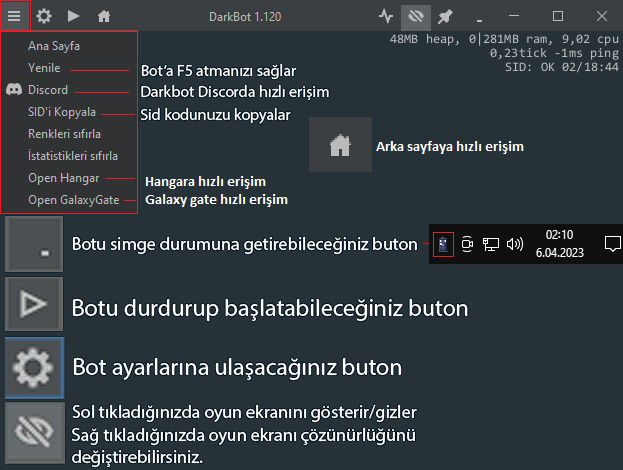

# Bot Kullanımı

## Bot Mini Ekranı

<figure><figcaption></figcaption></figure>

* Bu bölümde botunuzun versiyonu "**1.120**" ve Yenilemeye kalan süre "**00/01:00:00**" yer almaktadır. Botunuz çalışırken aşağıda kırmızı ile belirtilen alanda "**hangi modülü kullandığınız ve eğer hata alıyorsanız nedeni**" yazmaktadır.

<figure><figcaption></figcaption></figure>

*   Bu bölümde botunuzun işlem yapma cinsinden milisaniyesi "**0,0tick**", Oyun içi gecikme değeriniz "**64ms ping"** ve Oyun arka sayfasına bağlı olup olmadığınızı gösteren "**SID: OK 19/18:41**" yer almaktadır.

    <figure><figcaption></figcaption></figure>


"SID: KO" yada "SID: --" olduğunda oyun arka sayfasındaki bağlantınız düşmüş demektir, Bot yenileme yaptığında tekrar oyuna bağlanamayabilir.\
Not: SID hata verdiğinde GG spinner, skylab, açık artırma, sevkiyat, hangar değiştirme v.s. çalışmayacaktır.

Bot harici bir yerden oyunun arka sayfasına giriş yapmayın.&#x20;

"SID: KO" yada "SID: --" görünüyorsa botunuzu kapatıp tekrar açın.


*   Bot mini ekranındaki butonların işlevleri\

    <figure><figcaption></figcaption></figure>
