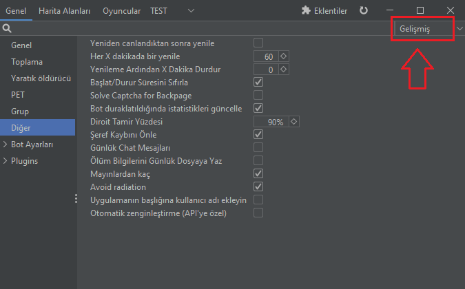

# Diğer

<figure><figcaption>
ÖZELLİKLERİN ÜZERİNE FARENİZ İLE GELİP BEKLEDİĞİNİZ ZAMAN AÇIKLAMALARI ÇIKACAKTIR
</figcaption></figure>

Her X dakikada bir yenile ; Botunuzun ne kadar sürede bir yenileme yapacağını ayarladığınız bölüm. İdeal süre 45-60 dakika. Eğer daha fazla bir süre girerseniz, yenileme süresine yaklaştıkça botunuzun bilgisayarınızda kullandığı ram ve cpu miktarı artacaktır, bu durum botunuzda donmalara, kasmalara ve bilgisayarınızda yavaşlamaya sebep olabilir hatta yeteri kadar raminiz yoksa botunuzun kapanmasına da sebep olabilir.

Otomatik zenginleştirme ; Botunuzun otomatik zenginleştirme yapması için seçeneği aktif hale getirmeniz ve Bot Ayarları kısmında bulunan DarkHook API toogles seçenekleri arasındaki Oto zenginleştirme özelliğini aktif hale getirmeniz gerekmekte.

