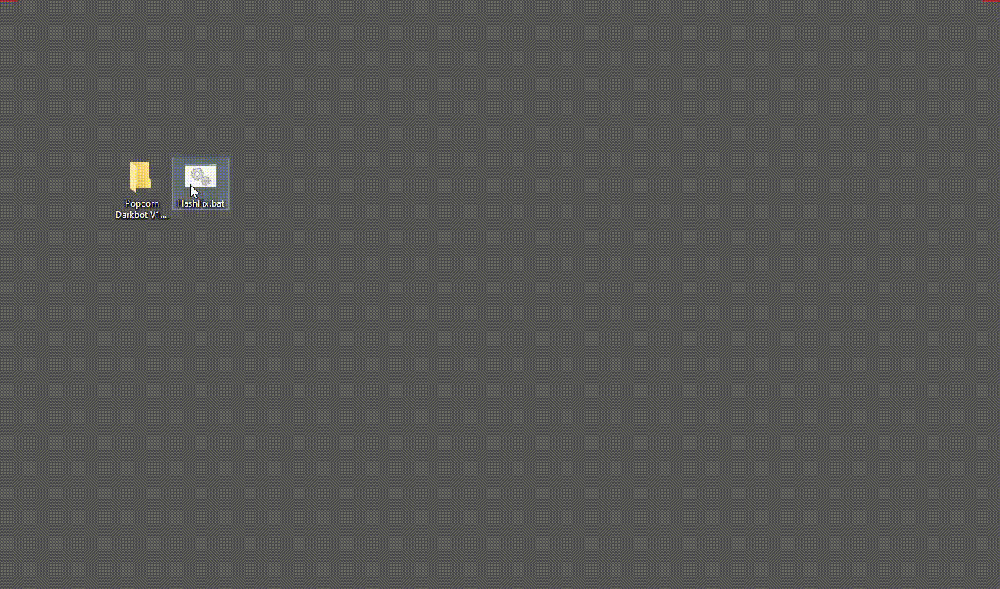
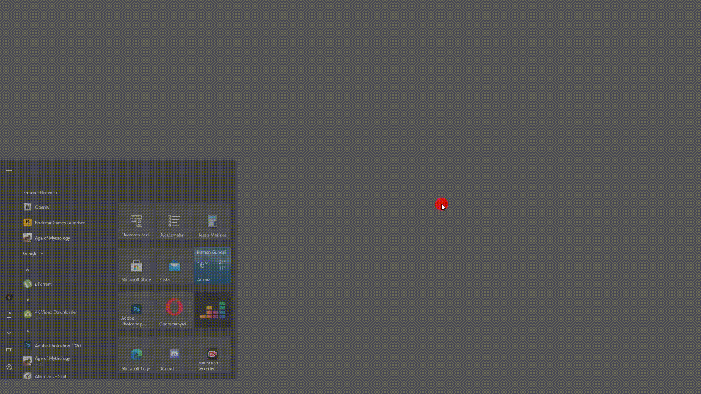

# Hata Çözümleri

## Botunuzun winrar olarak görünmesi

*   İndirdiğiniz **"Darkbot.jar"** dosyası winrar olarak görünüyorsa;\

    <figure><figcaption></figcaption></figure>

* İndirmiş olduğunuz botunuza sağ tıklayın ve aşağıda gösterildiği şekilde değiştirin.

<figure><figcaption></figcaption></figure>


Winrar dosyasını herhangi bir klasöre ayıklamayın yada içeriğini çıkarmayın sadece "**indirmiş olduğunuz dosyaya"** bu işlemi yapın.


## Botun Kapanması ve Java'nın Çalışmayı Durdurması

* Şifrenizi girdikten sonra botun aniden kapanmasına ya da Java çalışmayı durdurdu hatası almanıza neden olan, Windows'un KB4577586 numaralı Flash Player kaldırma güncellemesinden etkilenip Flash Playerınızı kaybettiyseniz [**Flashfix.bat**](https://darkbot.eu/downloads/FlashFix.bat)'ı indirin ve **Yönetici olarak çalıştırın**.


Windows tekrar Flash Player'ın kaldırılması için güncelleme yayınladığında aynı hatayı alabilirsiniz. Flashfix çözümünü tekrar uygulayın sorun çözülecektir.


## Yükleniyor Ekranında Takılma

* Bot çerez verilerini internet Explorer'a depolar. Botunuz, oyuna güncelleme geldiğinde açılışta takvim ekranında "**Yükleniyor**" bölümünde takılı kalıyorsa aşağıdaki çözümü uygulayın.

