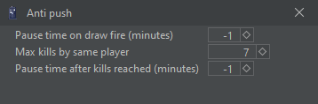
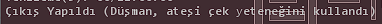

# ANTI PUSH

Pushingden banlanma riskinizi azaltan özellikler barındırır.\
(Eğer sayıları değiştiremiyorsanız; değiştirmek istediğiniz sayıyı yazın '**Enter'** tuşuna basın, daha sonra sağdaki yeşil kutucuğu işaretleyin.)

<figure><figcaption></figcaption></figure>

<figure><figcaption></figcaption></figure>

Pushingten banlanma riskini göze alıp özelliği kapatmayı da tercih edebilirsiniz.

<mark style="color:red;"><strong>1) Pause time on draw fire (min) =</strong></mark><strong> Üzerinize ateşi çek yeteneği kullanılırsa, portalda beklemenizi sağlar.</strong>                            <mark style="color:red;"><strong>2) Max kills by same player =</strong></mark><strong> Aynı kişi tarafından belirttiğiniz sayı kadar öldürüldüğünüzde</strong> <mark style="color:red;"><strong>3) Pause time after kills reached =</strong></mark><strong> Öldürülme sayısına ulaşıldığında bekleme süresi</strong>

1) ve 3) seçenekleri için ; -1 değer girerseniz botunuz siz müdahale edene kadar çalışmadan bekleyecektir. 0 değer girerseniz bu özellikleri kapatmış/devre dışı bırakmış olursunuz. 1-2-3-4 gibi değerler girerseniz, belirttiğiniz dakikanın bitiminde bot yeniden başlar.

<figure><figcaption></figcaption></figure>

Eğer görseldeki hata ile karşılaştıysanız ;  Pause time on draw fire (minutes) kısmındaki değeri '0' olarak değiştirmeniz gerekmekte.

