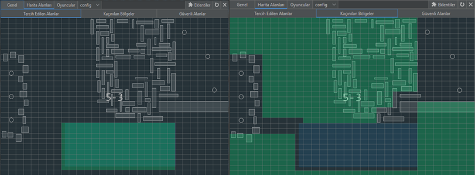

# PALLADIUM HANGAR

**Palladium Hangar:** Palladium toplar ve satmak için hangarları değiştirme özelliğini kullanır. (Hangarları değiştirebilmesi için SID:OK olduğundan emin olun)

<figure><figcaption></figcaption></figure>

-Genel ayarlardan modül olarak <strong>Palladium Hangar</strong> seçin  -Haritayı <strong>5-3</strong> yapın.  -5-2 haritasına gidin ve Harita alanları > Güvenli alanlar bölümünden satış bölgesinin kullanım koşulunu <code>her zaman</code> olarak değiştirin.  -Güvenlik sekmesindeki <strong>Düşmanlardan kaç</strong>, <strong>Görüş alanındaki Düşmanlardan kaç</strong> özelliğinin tiklerini kaldırın.  -<strong>ore_8</strong> (Palladium) toplamayı aktifleştirin ve    <strong>Bekle(ms)</strong> ayarını <strong>750</strong> yapın.  -Size saldıran NPClere sıkmak istiyorsanız listeden 5-3 haritasındaki NPCleri seçin ve ekstralardan <strong>Pasif</strong> olarak ayarlayın.  -Palladium alanı &#x26; port yolları hariç tüm alanı <strong>kaçınılan alan</strong> olarak ekleyin.  -Palladium alanını <strong>tercih edilen alan</strong> olarak ekleyin. -Portal atlama ayarlarını <strong>asla</strong> yapın. (Düşmandan kaçmaz.)  -Npc listesinden battleray <strong>öncelik</strong> ayarını <strong>100</strong> yapın.  -<strong>Oyun</strong> ayarlarından <strong>Arayüz</strong> > <strong>Hammaddeleri Göster</strong> özelliğini aktifleştirin.  -Palladium'u toplayan geminizin hangarı mutlaka satışı gerçekleştirecek olan geminizin hangarından yüksek olmalıdır. -Palladium toplayan geminizin her 2 konfisinde de ambar eşit olmak zorundadır.(Ambar genişletici takıyorsanız her 2 konfinizde de takılı olmak zorunda) -Gemi seçimi yapabilmeniz için hangarınızdan kullanmak istediğiniz gemileri favori olarak seçmeniz gerekmektedir. 

<figure><figcaption></figcaption></figure>

