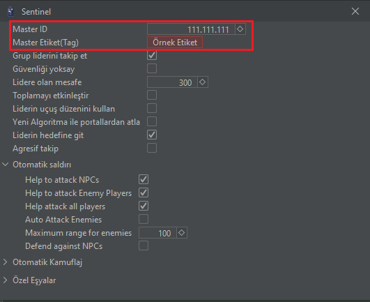
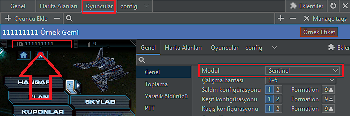

# SENTINEL

Sentinel Modül: Seçtiğiniz aynı haritadaki gemiyi takip eder. Aynı yaratığa ateş etmenizi ve kutu toplamanızı sağlar.

<figure><figcaption>
<strong>GÖRSELDEKİ SATIRLARIN ÜZERİNE GELİP BEKLEDİĞİNİZ ZAMAN AÇIKLAMALARI ÇIKACAKTIR.</strong>
</figcaption></figure>

-Takip eden ve takip edilecek(grup başkanı) gemi grupta olmak zorundadır. -Master ID takip edilecek geminin oyun ana sayfasında ki sol üstteki ID numarası olmalıdır. -Takip edilen geminin diğer ayarlarını bot ile ne yaptırtmak istiyorsanız ona göre ayarlamanız gerekmektedir. -Takip edecek geminin genel kısmındaki modül seçimi aşağıdaki gibi olmalıdır.

<figure><figcaption>
<strong>ETİKET(TAG) OLUŞTURMADA SORUNLAR YAŞIYORSANIZ DAHA DETAYLI BİLGİ İÇİN SOL KISIMDA BULUNAN GRUP ÖZELLİĞİ KULLANIMI KISMINI OKUYABİLİRSİNİZ.</strong>
</figcaption></figure>
