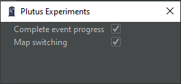

# Donor plugin - Bağışçılara özel

.png>)

## Plugin Açıklamaları

* **Pet Npc killer:** Space tuşuna basarak petinizin npcye yaklaşarak sıkmasını sağlar.


Oyunun kendi özelliğinden dolayı kamufle olduğunuzda petiniz npclere sıkmayacaktır.


* **Plutus Experiments:** Plutus müsabaka kapısını yapmanızı sağlar.

<figure><figcaption></figcaption></figure>

* **Quarantine module:** Şirketinizin x-7 haritasındaki Karantina grup kapısını yapmanızı sağlar.

.png>)

* **Labyrinth module:** Donmuş Labirent etkinliğindeki, labirent kapısını yapmanızı sağlar.

<figure><figcaption></figcaption></figure>

* **Player tagger:** Seçtiğiniz haritada yada seçtiğiniz npcyi öldüren oyunculara otomatik grup atar.

.png>)

* **Simple keys:** İstediğiniz tuşa belirlediğiniz şartlarda basmanızı sağlar.

.png>)

* **GG spinner:** Seçtiğiniz Galaxy kapısını otomatik olarak açar(gg basar) ve haritaya yerleştirir.\
  (Herhangi bir kapıdan 2 adet açıldığında parçalarınızın boşa gitmemesi için Enerji yada uri basmayı durdurur, 2 kapıdan birini bitirdiğinizde tekrar çalışmaya başlar.)

