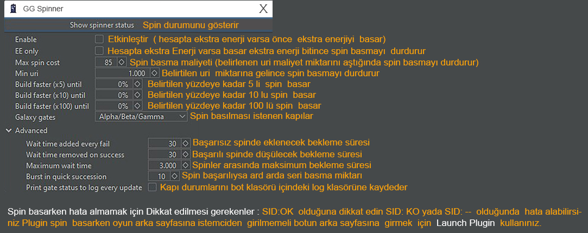

# GG SPINNER

GG spinner: Seçtiğiniz Galaxy kapısını otomatik olarak açar(gg basar) ve haritaya yerleştirir. (Herhangi bir kapıdan 2 adet açıldığında parçalarınızın boşa gitmemesi için Enerji yada uri basmayı durdurur, 2 kapıdan birini bitirdiğinizde tekrar çalışmaya başlar.)

Build faster (x5) until, Build faster (x10) until, Build faster (x100) until kısımlarını %0 olarak ayarlarsanız spin işlemini 1'li olarak yapacaktır.

