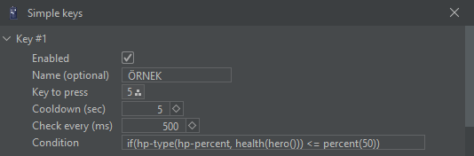
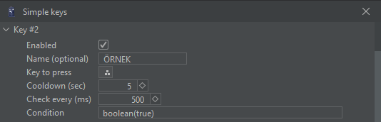

# SIMPLE KEYS

**Simple keys:** İstediğiniz tuşa belirlediğiniz şartlarda basmanızı sağlar.

<figure><figcaption></figcaption></figure>

if(hp-type(hp-percent, health(hero())) &#x3C;= percent(50))  Geminizin dp değeri %50 ve aşağısına düştüğü zaman belirlediğin tuşa basacaktır. Dp değerini değiştirerek istediğiniz gibi ayarlayabilirsiniz.

<figure><figcaption></figcaption></figure>

boolean(true) Eğer değer doğru ise (eğer atadığınız tuştaki yetenek bekleme süresinde değilse yani kullanılabilir durumda ise) atadığınız tuşa basmasını sağlayacaktır.

