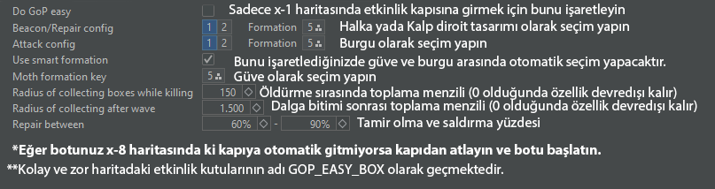

# Kekka Plugin - Bağışçılara özel

Kekka Plugin discord sunucusu: [https://discord.gg/m4CMbBd5h6](https://discord.gg/m4CMbBd5h6)

* **Galaxy module:** Çoğu galaksi kapısını yapar ve kamikaze kullanarak kapıları bitirebilirsiniz.

* **GoP Module:** Gaunlet of Plutus etkinlik kapısını yapmanızı sağlar.

* **LoW module:** x-3 haritanızda bulunan Low kapısını yapmanızı sağlar.

<figure><figcaption></figcaption></figure>

* **Eternal Blacklight:** x-BL haritasındaki Ebedi kapıyı yapmanızı sağlar.

<figure><figcaption></figcaption></figure>


Güveyle Npc öldürürken eğer kalkanınız 0 oluyorsa; Botun genel ayarlarından ve Eternal modülünden kalkan tamir yüzdesini 0 yapın.


* **Hades module:** Hades kapısını yapmanızı sağlar.

<figure><figcaption></figcaption></figure>

* **Guardian \[KD]:** (Kekka Plugine Bağış Yapanlara Özel) - Grup liderini takip eder ve saldırdığı aynı hedefe saldırır.

.png>)

* **Chaos Spawner\[KD]:** \[KD]\(Kekkaya bağış yapanlara özel)::\
  Protegit tantanası etkinliğinde cpuları otomatik olarak basmanızı ve öldürmenizi sağlar.

<figure><figcaption></figcaption></figure>

* **Galaxy Helper:** Belirlediğiniz sürede Galaxy kapıları hakkında(bulunduğun dalga, kalan hayat) istatistik sağlar.

.png>)

* **Skylab Builder:** Gerekli hammaddeler varsa skylabınızı 20 seviyeye otomatik olarak geliştirir.

.png>)
