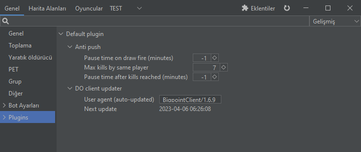
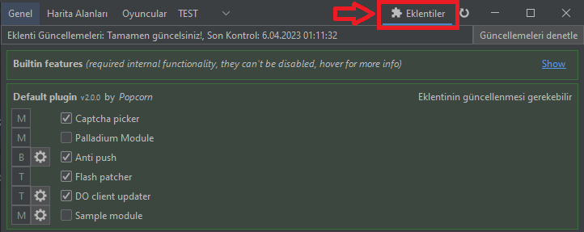

# Plugins

<figure><figcaption></figcaption></figure>

Pluginlerinizi kontrol etmek ve ayarlarınızı yapmak için bu kısmı kullanmayın, bütün özellikleri ve bütün detayları bu kısımdan görüntüleyemiyorsunuz. Bu kısım yerine aşağıda bulunan görseldeki bölümü kullanmanız gerekiyor.

<figure><figcaption></figcaption></figure>
